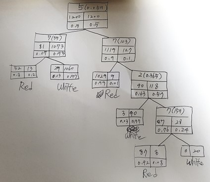

# Decision Tree(C4.5)
인공지능 동아리 ‘ICU’에서 Decision tree(C4.5)를 바닥부터 짜보는 활동함(2017. 10 ~ 2018. 01)
(예전에 구현한 것이라 부족한 점이 많군...)
## Code 설명  
__main.cpp__  
data set을 받아들여 실행하는 부분.  

__csvTovector.cpp__  
~~~
vector<vector<float> > ConvertToVector(char file1[], char file2[])  
~~~
csv파일을 읽고 vector<vector<float>>의 형태로 return 한다.  

__C45.cpp__  
~~~
typedef struct Node  
{  
    vector<vector<float>> vWine;  
    int nAttr; //몇번째 attribute인지 저장.  
    float fAttribute_value;
    int nNumOfRed; //red wine의 갯수 저장.
    int nNumOfWhite; //white wine의 갯수 저장.
    float fProbablityOfRed; //red일 확률 저장.
    float fProbablityOfWhite; //white일 확률 저장.
    
    int nOutcome; //red 갯수가 많으면 1, white 갯수가 많으면 2 저장. 이것을 통해 test이 들어왔을 때 red인지 white인지 결정.
    
    struct Node *pLeft;
    struct Node *pRight;
}Node;
Node* c45(vector<vector<float>> vWine) //실제 c4.5 구현.
void initNode(Node* pNode) //node 초기화
~~~
__IGCalculator.cpp__
~~~
typedef struct IG_Info
{
    float fAttr_value;
    double dIG_value;
}IG_Info;

//한가지에 대해서만 엔트로피를 구할 때 사용하는 function.
double Entropy1(float arr[], int nSize) 
//두가지 요소 간에 엔트로피를 구할 때 사용하는 function.
double Entropy2(vector<float> const& arr1, float arr2[], int nSize)

//information gain을 구하는 function.
double IG(double dEnt1, double dEnt2)

//(Sorting 하지 않음) 한 attribute에 대한 column이 들어왔을 때, 그 column을 기준으로 모든 value의 IG을 구해서 IG이 가장 큰 것의 정보를 저장.
IG_Info MaxIG_Info(float fRorW[], float fAttr[], int nSize)
~~~

__traversal.cpp__
~~~
//preorder traversal 이용해서 tree 확인.
void preorder_traversal(Node* pRoot);

//data set으로 들어간 wine을 분석하여 red 와인인지 white 와인인지 예측하고, 실제 값(실제로 red 와인인지 white인지)과 비교하여 accuracy를 return 함.
int accuracyCalc(Node* pRoot, vector<vector<float> > vWine);
~~~

## 결과
- Wine 데이터에 적용

- red wine과 white wine을 train set으로 넣어준 결과가 위와 같다. 종료 조건은 red인 비율이 0.95보다 크거나 white인 비율이 0.95보다 크거나, red 또는 white의 갯수가 20개보다 적을 때이다. 
- 그 결과 node가 나눠지는 횟수는 5번이다. 처음 나눠질 때 information gain이 가장 큰 것은 5번째 attribute의 0.059라는 값이다. 따라서 이 값을 기준으로 나눠지는데 나눠진 후 왼쪽 node는 white wine의 비율이 0.93이고 오른쪽 node는 red wine의 비율이 0.9일 정도로 굉장히 잘 나눠진다는 것을 확인할 수 있다. 5번째 attribute는 chlorides으로 염화물이라는 것이다. 따라서 염화물의 비율만으로도 어느 정도 red인지 white인지 예측할 수 있다.
- 또한 5번 나눠지는 과정 중 3번이 7번째 attribute에 의해서 나눠진다는 것을 알 수 있다. 7번째 attribute는 total sulfur dioxide으로 총 이산화황이라는 것이다. 이 attribute 역시 red와 white를 잘 나누는 속성이라는 것을 알 수 있다.
- Node라는 struct에는 nOutcome이라는 변수가 있다. 각각 node의 nOutcome마다 red와 white 중 갯수가 더 많은 것의 정보를 저장한다(red가 많으면 1, white가 많으면 2를 저장). nOutcome과 fAttribute_value를 이용해서 test set을 예측한다(fAttribute_value보다 크고 작은 지에 따라서 자식 node로 이동하고 그 자식 node에서 nOutcome을 이용해서 red인지 white인지 예측함).
- accuracyCalc()라는 함수를 이용해서 test set을 확인해 본 결과, 총 798개의 data set 중 778개의 data가 예측한 값과 같았으며 97.5%의 정확성을 확인할 수 있었다.

